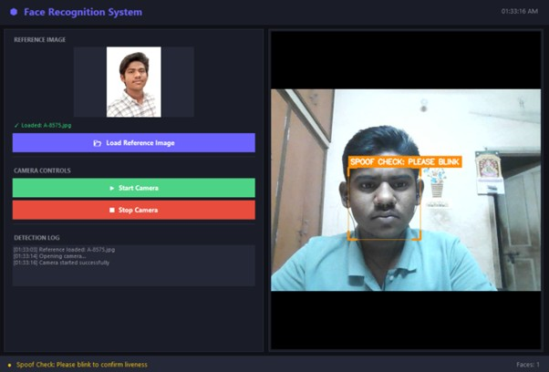
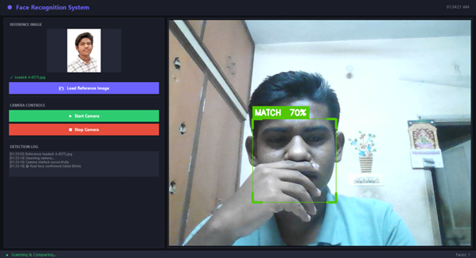
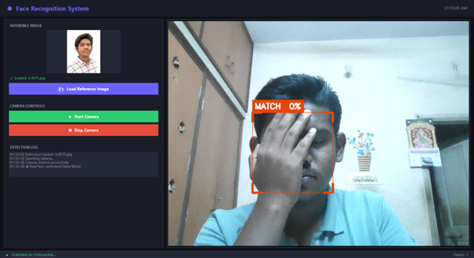
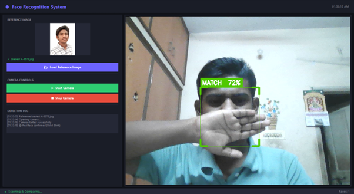
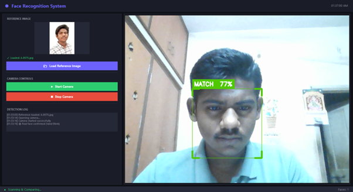

<h1 align="center">FaceAttend</h1>

<p align="center">
Offline Facial Recognition and Liveness Detection System
</p>

<p align="center">
Edge AI Attendance and Authentication Solution for Remote Environments
</p>

---
# Working Demonstration

## Face Detection and Recognition

<p align="center">
  
</p>

---

## Liveness Verification

<p align="center">
  
</p>

---

## Authentication Result

<p align="center">
  
</p>

---

## Real-Time Recognition Pipeline

<p align="center">
  
</p>

---

## Offline Attendance Workflow

<p align="center">
  
</p>

---

# Overview

FaceAttend is a lightweight offline facial recognition and liveness detection system designed for secure attendance and identity verification in remote and low-connectivity environments.

The project focuses on:

- Real-time offline authentication
- Blink-based liveness verification
- Lightweight edge AI inference
- Anti-spoof security mechanisms
- Mobile deployment compatibility
- Zero cloud dependency during recognition

Developed as part of the NHAI Hackathon challenge:

> Develop a mobile-based secure offline facial recognition and liveness detection system for remote locations.

---

# Key Features

- Offline facial recognition
- Real-time face detection
- Blink-based liveness detection
- Anti-photo spoof protection
- Local embedding matching
- Lightweight edge AI pipeline
- No internet dependency
- Camera-based authentication
- Mobile deployment ready
- Cross-platform architecture

---

# System Architecture

```text
Camera Input
     │
     ▼
BlazeFace Face Detection
     │
     ▼
MediaPipe Landmark Extraction
     │
     ▼
Blink EAR Liveness Verification
     │
     ▼
SFace Embedding Extraction
     │
     ▼
Cosine Similarity Matching
     │
     ▼
Authentication Result
```

---

# Technology Stack

## Computer Vision & AI

- OpenCV
- MediaPipe
- NumPy

## User Interface

- Tkinter
- Pillow

## Planned Mobile Deployment

- React Native
- TensorFlow Lite
- Android
- iOS

---

# AI Models

| Model | Purpose | Size |
|---|---|---|
| BlazeFace | Face Detection | 0.22 MB |
| FaceLandmarker | Landmark Detection & Liveness | 3.58 MB |
| SFace | Face Recognition Embeddings | 36.90 MB |

---

# Project Structure

```text
face recognition/
│
├── README.md
├── requirements.txt
├── face_recognition_app.py
├── blaze_face_short_range.tflite
├── face_landmarker.task
├── face_recognition_sface_2021dec.onnx
└── WORKING/
    ├── 2.jpg
    ├── 3.png
    ├── 4.png
    ├── 5.png
    └── 6.png
```

---

# Installation

## Clone Repository

```bash
git clone https://github.com/your-username/FaceAttend.git
cd FaceAttend
```

---

## Install Dependencies

```bash
pip install -r requirements.txt
```

---

## Run Application

```bash
python face_recognition_app.py
```

---

# Requirements

```txt
opencv-contrib-python >= 4.8.0
mediapipe >= 0.10.0
pillow >= 10.0.0
numpy >= 1.24.0
```

---

# Face Recognition Pipeline

The recognition system performs the following stages:

1. Face Detection
2. Facial Landmark Extraction
3. Face Alignment
4. Embedding Generation
5. Cosine Similarity Matching
6. Authentication Result Generation

SFace embeddings are used for identity verification.

---

# Liveness Detection

The application uses an Eye Aspect Ratio (EAR) based blink detection mechanism for liveness verification.

## Verification Flow

1. Eye-open state detection
2. Blink event detection
3. Eye reopen validation
4. Liveness confirmation

An additional face-height stability check is implemented to prevent spoof attacks using tilted photographs or display screens.

---

# Security Design

The system includes:

- Offline-only inference
- No external API dependency
- Local embedding comparison
- Blink-based liveness verification
- Anti-photo spoof detection
- Temporary in-memory processing
- Lightweight edge AI execution

---

# Performance Targets

| Metric | Target |
|---|---|
| Recognition Accuracy | >95% |
| Processing Time | <1 second |
| Offline Capability | Supported |
| GPU Requirement | Not Required |
| Supported Platforms | Android / iOS |

---


# Planned Improvements

- INT8 quantized face recognition model
- Reduced model footprint for mobile deployment
- React Native integration
- SQLite offline attendance storage
- AWS sync and purge mechanism
- Multi-challenge liveness verification
- Head movement and smile detection

---

# React Native Migration Roadmap

The desktop prototype validates the AI pipeline before mobile deployment.

Planned integration components:

- react-native-fast-tflite
- react-native-vision-camera
- react-native-fs

Target deployment specifications:

- Android 8+
- iOS 12+
- 3 GB RAM minimum
- Fully offline operation

---

# Open-Source Dependencies

| Dependency | License |
|---|---|
| OpenCV | Apache 2.0 |
| MediaPipe | Apache 2.0 |
| Pillow | HPND |
| NumPy | BSD-3-Clause |

No proprietary dependencies are used.

---

# License

This project uses only open-source technologies and is intended for research, educational, and hackathon demonstration purposes.

---

# Authors

FaceAttend Development Team

NHAI Hackathon Submission  
Offline Facial Recognition and Liveness Detection System
